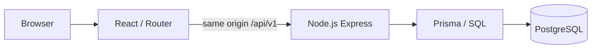

# Dhaka Tesla Pool

Share a seat. Split the fare. Survive Dhaka traffic.

A small ride-pooling MVP for RoBenDevs’ Software Engineer Internship assessment. Jashim drives Bullet, a three-seat vehicle; Nusrat, Rafiq, and Shirin request compatible trips. The eventual product must keep each passenger's fare private and never oversell Bullet.

**Status: authentication and the complete single-booking ride lifecycle are implemented and verified.** Shared pooling is the next milestone. Submission deadline supplied by the candidate: **27 September 2026, 23:59 Bangladesh time**. Requirements source: [supplied PRD](Dhaka_Tesla_Pool_PRD_Internship.pdf), all five pages read.

## Implemented versus planned

Implemented: PostgreSQL-backed authentication (passenger registration, seeded passenger/driver login, logout/me, CSRF, role middleware, expiry and rate limiting), plus React/Router/Vite TypeScript scaffold, Express health API, PostgreSQL/Prisma ten-table schema and SQL constraints, insert-only demo seed with scrypt password hashes, same-origin proxy, Docker setup and health checks, API health tests and real-database foundation checks.

Implemented UI: passenger registration, both-role login, session restoration, role-protected landing pages, logout, retryable failures and accessible responsive forms.

Implemented rides: route/seat selection, solo fare previews, idempotent requests, driver availability/acceptance, arrival, start, drop-off, completion, valid cancellation, histories and five-second polling. One booking per pool can reserve multiple seats. Transactions and real PostgreSQL tests cover acceptance/cancellation races.

Planned: shared matching, additional bookings in a pool, pooling discounts and shared last-seat concurrency tests. The one-booking limit is temporary, with no permanent schema restriction.

Public deployment URL: **pending**. Demo video (maximum six minutes): **pending**. Authentication screenshots: [login](docs/images/auth-login-desktop.png), [passenger](docs/images/auth-passenger-desktop.png), [mobile registration](docs/images/auth-register-mobile.png). Foundation screenshots: [desktop](docs/images/foundation-desktop.png) / [mobile](docs/images/foundation-mobile.png).

## Quick start — Docker

Prerequisite: Docker Desktop running Linux containers (or Docker Engine), Compose v2, free ports 8080. Node 24 is used by the optional local environment helper; otherwise copy .env.example and replace SESSION_SECRET with a securely generated random secret. No host PostgreSQL installation is needed.

```powershell
node scripts/setup-local-env.mjs
docker compose up --build -d
docker compose ps -a
```

The environment helper works on Windows/macOS/Linux and preserves existing settings and secrets. Open **http://localhost:8080**. The root opens login or your role-specific workspace. Visit **http://localhost:8080/foundation** for connectivity status. Initial image downloads can take several minutes. Subsequent `docker compose up` uses the built images. Database health gates the one-shot migration/seed service, which must exit successfully before API startup; API readiness gates the frontend.

```powershell
docker compose logs init api
curl.exe -i http://localhost:8080/api/v1/health/live
curl.exe -i http://localhost:8080/api/v1/health/ready
docker compose down
```

`down` preserves the named `postgres_data` volume. Do not add `-v` unless intentionally deleting all data. App/database credentials are **local demo defaults**, not deployment secrets. Frontend binds loopback; DB/API are internal. Changing PostgreSQL initialization credentials does not change existing volume credentials. URL-encode reserved characters if customizing passwords in connection URLs.

Migrations are versioned under `apps/api/prisma/migrations`. The init service runs `prisma migrate deploy`, never schema reset/db push. It seeds only when `SEED_DEMO=true` (local default). Seed reruns insert missing cast/reference records, preserving passwords, profiles, vehicles and all application history. To rerun explicitly:

```powershell
docker compose run --rm init
```

## Local development

Node **24.x**, npm (verified with 11.17.0), Docker Compose for PostgreSQL. Commands run from repository root; on PowerShell use `npm.cmd` if script execution policy blocks `npm`.

```powershell
node scripts/setup-local-env.mjs
npm ci
npm run db:generate
docker compose -f compose.yaml -f compose.dev.yaml up -d db
npm run db:migrate
npm run db:seed
npm run dev:api
```

In another terminal: `npm run dev:web`. Open **http://localhost:5173**; Vite proxies `/api` to localhost:3000. The optional dev Compose file exposes PostgreSQL only at 127.0.0.1:5433. Use the same two `-f` options when stopping that development DB. Stop a full Compose stack before switching modes. No CORS configuration is needed.

## Verification

```powershell
npm run db:generate
npm run typecheck
npm test
npm run build
npm run db:migrate
npm run db:seed
npm run test:db
git diff --check
```

`test:db` requires the migrated, seeded local DB at DATABASE_URL. It repeats the seed twice and compares every table, checks demo hash formats/salts, and verifies constraints with fixtures rolled back in one PostgreSQL transaction. Use an isolated development database with no concurrent writers; do not run it on production. This is foundation validation, not proof of booking concurrency. Docker-only equivalent: `docker compose run --rm init npm run test:db`.

See [progress and actual verification results](docs/progress.md). API contract tests use Vitest/Supertest. Later tests must cover the two exact fare examples, ownership, lifecycle, cancellation, idempotency, and competing claims for the last seat.

## Demo cast and environment

| Account | Email | Role |
|---|---|---|
| Jashim | jashim@demo.dhaka.test | Driver of Bullet, 3 seats, initially offline |
| Nusrat | nusrat@demo.dhaka.test | Passenger |
| Rafiq | rafiq@demo.dhaka.test | Passenger |
| Shirin | shirin@demo.dhaka.test | Passenger |

All initial demo passwords: `DemoOnly!Dhaka2026`. **Demo only; use /login for either role.** Database stores salted scrypt hashes, never plaintext. Existing passwords are not reset by seeding. Banani–Mohakhali (3 km) and Banani–Gulshan 1 (4 km) share a compatibility group; Dhanmondi–Mirpur supplies a noncompatible example. All are simplified demo data, not road routing.

| Variable | Purpose |
|---|---|
| POSTGRES_USER / POSTGRES_PASSWORD / POSTGRES_DB | Local Compose initialization and internal API connection |
| DATABASE_URL | Host-run Prisma/API PostgreSQL URL; Compose uses internal db hostname |
| PORT | Host API port; default 3000 (Vite proxy expects this) |
| WEB_PORT | Compose frontend port; default 8080 |
| NODE_ENV | development locally; production in API container |
| SEED_DEMO | Explicit permission to insert demo users; true locally, disable for real environments |

Run `node scripts/setup-local-env.mjs` once before startup. It creates .env if missing, generates a random SESSION_SECRET only when missing/placeholder, and preserves existing configuration. The secret must remain stable across restarts. SESSION_COOKIE_SECURE=false is only for loopback HTTP; HTTPS deployment uses true. AUTH_ORIGINS lists exact allowed browser origins (update it when changing WEB_PORT). Host TRUST_PROXY_HOPS=0; Compose uses one private Nginx hop. AUTH_TEST_DATABASE_URL targets only the isolated test database.

Authentication setup, limits, API usage, browser verification and manual review steps: [authentication guide](docs/authentication.md).

Focused backend verification (no browser automation):

```powershell
docker compose -f compose.auth-test.yaml up -d --wait db
npm run typecheck -w @dtp/api
npm run test:auth -w @dtp/api
npm test -w @dtp/api
npm run build -w @dtp/api
node scripts/auth-runtime-smoke.mjs
docker compose -f compose.auth-test.yaml down
```

The runtime smoke command requires the main Compose stack running and briefly restarts its API to prove PostgreSQL session persistence. Auth integration tests use disposable PostgreSQL on :5434 and never reset the development database. Authenticated sessions last 8 fixed hours; pre-login CSRF sessions last 1 hour. Login/register share 10 attempts per IP per 15 minutes; token bootstrap allows 60. These process-local limits reset on restart.

## Architecture and ownership

[Architecture and transaction plan](docs/architecture.md) · [ERD/table rationale](docs/erd.md) · [PRD requirements versus assumptions](docs/assumptions.md) · [API contract](docs/api-contract.md) · [agent instructions](AGENTS.md)



```text
apps/web       React UI, CSS Modules, fetch wrapper, Vite/Nginx proxy
apps/api       HTTP layer, Prisma schema/migrations/seed, health and DB checks
docs           Architecture, ERD, assumptions, API contract, verification
compose.yaml   Frontend/API/init/PostgreSQL with named storage
```

Controllers handle HTTP; later services enforce prices, ownership, state and seat allocation. Foreign keys, role constraints and partial active indexes defend database invariants. A bounded seat counter alone cannot ensure membership consistency: future mutations must lock and update membership/counter/history atomically.

## Stack choices and realistic alternatives

| Choice | Why it fits; alternative; when to switch |
|---|---|
| React + Vite + Router + TypeScript | Mandated React, simple SPA with typed boundaries; Next.js is an alternative if SSR/SEO or server rendering becomes important. |
| Node + Express | Mandated Node, explicit small HTTP layer; Fastify for schema-driven performance, NestJS if a much larger team needs framework conventions. |
| REST | Resource/lifecycle actions are easy to inspect and test; GraphQL if clients genuinely require varied nested projections. |
| PostgreSQL | Transactions, row locks, partial unique indexes suit contested seats; MySQL is viable with different active-uniqueness design; SQLite for single-user prototypes only. |
| Prisma 7 + SQL migrations | Typed queries and reviewable migrations; SQL retained for PostgreSQL constraints. Drizzle/raw SQL if ORM friction dominates complex matching queries. |
| PostgreSQL sessions | Revocable sessions across instances without another datastore; JWTs if external clients need delegated stateless tokens, with a revocation strategy. |
| Scrypt | Node's built-in memory-hard hashing avoids native addon deployment work; Argon2id if operational support warrants a dedicated hashing package. |
| Zod | Shared TypeScript-friendly input validation; JSON Schema/Ajv if schema interoperability becomes more important. |
| CSS Modules | Scoped styles without a design-system dependency; utility CSS/component library if repeated UI patterns outgrow this small app. |
| React state/auth context + fetch | Small UI needs no global cache library; TanStack Query if cache invalidation/loading complexity grows. |
| 5-second ride polling | Easy failure/reconnect behavior; SSE/WebSockets if measured freshness or polling load demands it. |
| Vitest + Supertest + real PostgreSQL | Fast HTTP tests plus actual DB semantics; Playwright verifies authentication and separate-session passenger/driver journeys against real PostgreSQL. |
| Docker Compose | Reproducible assessment deployment; managed hosting later for operations. Only free/free-tier providers; provider decision pending. |

[Dependency notes and version-specific references](docs/dependencies.md) record observed advisories and documentation consulted.

## Workflow and limitations

`feature/* → master → pre-release → release/v1.0.0`. Authentication, including the five verified formatting-only edits in 641615a, was fast-forwarded into master. Ride work is on `feature/ride-lifecycle` for review. No push/deployment, history reset, fabricated commits, or early release branches. Later branches are cut at integration/release stages.

Driver cancellation/reassignment is out of MVP. No real routing, GPS, payments, chat, Redis, queues, or microservices. No public deployment has been attempted. Single-booking demo rides work; shared pooling remains pending. Seed upserts are individually idempotent; if a seed is interrupted, rerun to finish missing records.

## AI usage — observed record

OpenAI Codex read the supplied PRD, inspected the environment, authored this foundation and documentation, consulted dependency documentation, and ran the recorded checks. A temporary Node PDF reader was used because Python/Poppler were unavailable. The candidate supplied the stack and detailed product decisions before this session; do not present them as newly accepted AI suggestions.

- Accepted suggestion example: **pending candidate review**; no explicit acceptance observed.
- Rejected/changed suggestion example: **pending candidate input**; no explicit rejection observed.
- Observed implementation correction: Prisma validation required composite uniqueness for role-bearing one-to-one relations; Codex added it and reran checks. This is a technical correction, not an invented candidate rejection.

The candidate must review and be able to explain every shipped part. Before final submission, replace the pending disclosure examples with real decisions from the collaboration.


Backend checkpoint AI record: Codex implemented the user-requested auth API, session/CSRF protection, isolated PostgreSQL tests and runtime restart check. The candidate explicitly narrowed this checkpoint to backend work and deferred frontend/browser testing. A test assertion was corrected after inspecting connect-pg-simple's whole-second expiry rounding; exact application expiry remains independently checked. This is an observed engineering correction, not a fabricated accepted/rejected suggestion.

## Frontend authentication verification

See [the authentication guide](docs/authentication.md#frontend-authentication) for isolated browser tests and manual steps. Run `npm test -w @dtp/web` for the 22 focused UI tests (16 authentication and 6 rides); root `npm test` currently runs API tests only.

The implementation keeps TypeScript at the boundaries: `src/api.ts` handles requests/errors, `src/auth/AuthContext.tsx` manages session state, `src/auth/AuthPages.tsx` contains forms and role guards, and `src/App.tsx` defines routes. The function bodies use familiar JavaScript/React patterns. Generated Prisma files are not tutorial entry points and should not be edited.

Frontend AI record: Codex implemented the requested forms/session integration and tests, verified real backend browser journeys and desktop/mobile layouts, and preserved pre-existing backend edits. No candidate acceptance/rejection examples were invented.

## Demonstrate the ride lifecycle

Follow the [exact two-window demonstration and test commands](docs/ride-lifecycle.md#manual-demonstration). Open http://localhost:8080/login in separate browser sessions for Nusrat and Jashim, then use /passenger and /driver. One seat from Banani to Mohakhali costs 50 BDT; fare becomes fixed at arrival. Histories are at /passenger/history and /driver/history.

Ride screenshots: [passenger desktop](docs/images/ride-passenger-desktop.png), [driver mobile](docs/images/ride-driver-mobile.png).

Ride AI record: Codex inspected and normalized the five outstanding diffs before committing them separately, integrated authentication with preserved history, implemented the requested lifecycle and tests, and verified it in separate browser contexts. The coarse PostgreSQL advisory lock is an explicit implementation trade-off for this milestone, not a candidate-endorsed scalability claim. During verification, a recovered intent cleanup assertion was changed to await its React effect; the browser independently verified successful recovery after a lost booking response.
