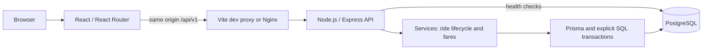

# Architecture

Development: Vite :5173 proxies /api to Express :3000. Compose: Nginx :8080 serves the built frontend and proxies /api to the internal API; PostgreSQL has a named volume. A one-shot init service runs versioned migrations and optional insert-only seed before API startup. API/frontend containers run as non-root users. No public API/DB ports in the default Compose path; a dev override exposes DB on loopback :5433.

Controllers own validation/HTTP mapping; services own ride permissions, state and solo fares. Shared matching remains planned. PostgreSQL owns referential integrity, role relationships, active uniqueness, and row bounds. Native fetch is shared by the frontend. No SSR requirement makes a Vite SPA sufficient.

## Implemented transaction strategy

The single-booking milestone uses a transaction-scoped PostgreSQL advisory lock shared by every ride mutation, before any business-state read. This deliberately serializes ride writes across API processes at demo scale; reads use repeatable-read snapshots. Booking creation, acceptance, cancellation, availability, arrival, start, drop-off and completion all follow this strategy. Existing partial unique indexes remain backstops. The real-PostgreSQL suite verifies competing acceptance, cancellation races, idempotency and rollback. See [ride lifecycle](ride-lifecycle.md).

## Future fine-grained transaction plan

Lock order: driver user rows (sorted IDs), vehicle rows (sorted IDs), pool rows (sorted IDs), request rows (sorted IDs), then memberships. All competing operations use this order. A waiting-request-only cancellation locks its request; it never then locks an upstream row. If an optimistic read discovers a membership/pool changed, roll back and retry with the complete lock set instead of reversing the order.

Acceptance locks driver/vehicle, rechecks online/no active pool, then locks target/waiting requests in ID order and processes eligibility in created_at/id order. Two drivers may contend on one request; the loser rechecks after locking and gets 409. Joining a pool locks driver/vehicle/pool then request; recheck boarding status, compatibility, ownership and capacity. A conditional seat-counter increment and membership insert happen in one transaction. Never treat a CHECK constraint as aggregate capacity enforcement.

Cancellation and arrival lock the same pool before requests: cancellation either releases seats first and is excluded from arrival pricing, or arrival commits first and cancellation gets 409. Arrival freezes fares and writes events in the same transaction. Drop-off releases allocations once. Read states after locks for idempotent lifecycle retries. Going offline uses the same driver lock, checking active pools. Partial unique indexes provide backstops for simultaneous active resources.

Booking creation uses unique (passenger_id, idempotency_key) plus normalized payload fingerprint; repeat same key/payload returns the original request (even if terminal), different payload → 409. A same-key race resolves by reading the winner after rollback. Deadlocks/serialization errors get bounded whole-transaction retries; no external side effects inside transactions. Events have unique operation keys to guard replay. The implemented advisory-lock strategy currently supplies this protection; the ordered row-lock plan above is a future replacement, not an additional live locking path.

## Security

PostgreSQL-backed express-session/connect-pg-simple, opaque HttpOnly cookies, Secure over HTTPS, SameSite=Lax, session regeneration at login, destruction at logout, expiry and pruning. Synchronizer CSRF token bound to session for all mutations plus origin validation. Rate-limit login/register; derive all identities from session, never payload IDs. Validate Zod inputs and return 404 for inaccessible private resources. Passengers see only their fares; driver member views expose necessary pickup/seat/name data. Avoid session, password, and private payload logging. All five authentication routes now exist; [authentication details](authentication.md) document fixed expiry, exact CSRF/origin checks, cookie/proxy settings, role middleware and rate limits.

## Verification layers

Foundation: health contract tests, TypeScript/build checks, real PostgreSQL migration/constraint/seed checks, Compose startup and browser connectivity. Later: authentication/privacy, state transitions, exact fare examples, cancellation/arrival races, idempotency, and concurrent last-seat claims. In-memory mocks cannot prove PostgreSQL locks work.

At larger scale, first measure query latency/lock waits and add indexes; stateless API instances can share PostgreSQL sessions. Matching writes stay on the primary. Read replicas may serve stale history, not seat allocation. Geospatial search, event delivery, caching, and push updates require measured demand, not foundation dependencies.
