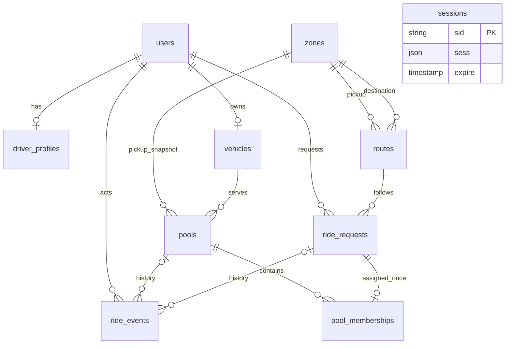

# Database model

Ten tables: users (identity/role/password hash), sessions (library-owned JSON session payload/expiry, intentionally no user FK), driver_profiles (online state), vehicles (one driver/fixed capacity), zones (reference labels), routes (pickup/destination/group/demo meters), ride_requests (immutable request, idempotency, fare snapshots), pools (capacity/pickup/group snapshots and allocated seats), pool_memberships (retained allocation history), ride_events (actor, operation key, typed state changes and metadata).

UUID IDs except library session IDs. UTC timestamptz timestamps; session expiry follows connect-pg-simple's timestamp(6) schema. Unique normalized emails and composite role references ensure driver-only profiles/vehicles and passenger-only requests. Every pool's driver is derived through its vehicle. A unique vehicle.driver_id plus partial active-pool uniqueness enforces one active pool/driver. One membership/request preserves assignment history; reassignment is out of scope.

Foreign keys use RESTRICT unless a nullable event actor is deleted (SET NULL); app-level account deletion is not implemented. Reference records/history must not disappear with parent deletion. SQL checks cover positive seats/meters/capacity, nonnegative fare inputs, bounded discount, finalization consistency, allocation bounds, and release metadata consistency. Partial active indexes and lowercase email uniqueness live in the SQL migration, because Prisma's model alone does not describe them. SQL alone does not enforce lifecycle edges, fare correctness or membership sums. The implemented ride transaction service and real-PostgreSQL tests enforce these for the single-booking milestone.

Indexes target waiting requests, passenger history, compatible active pools, pool history, live memberships, event history, and session expiry. Fare fields remain on ride_requests; no fare/payment tables.
